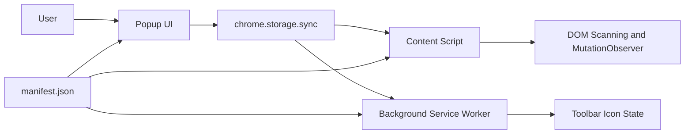
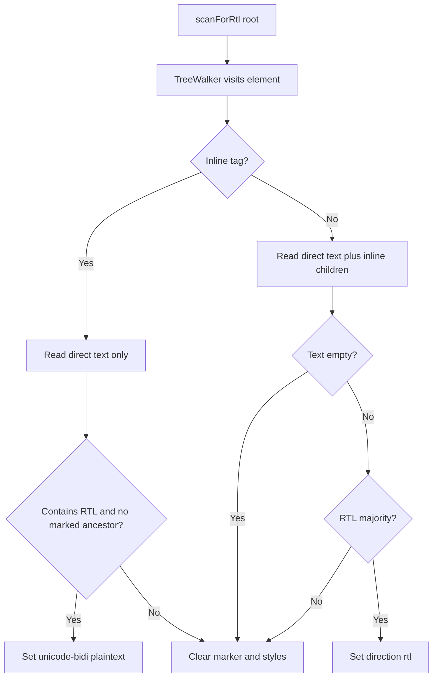
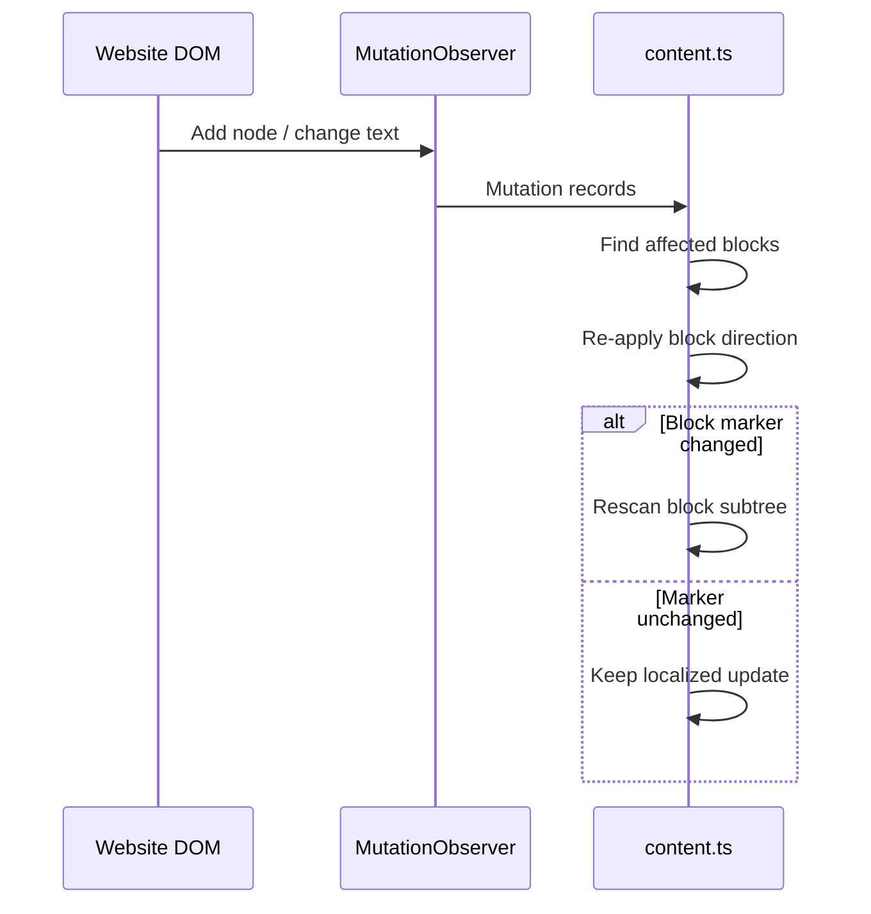
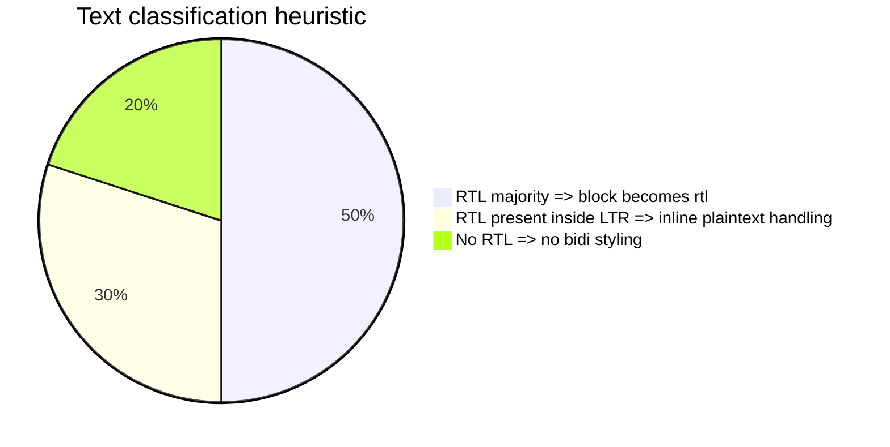
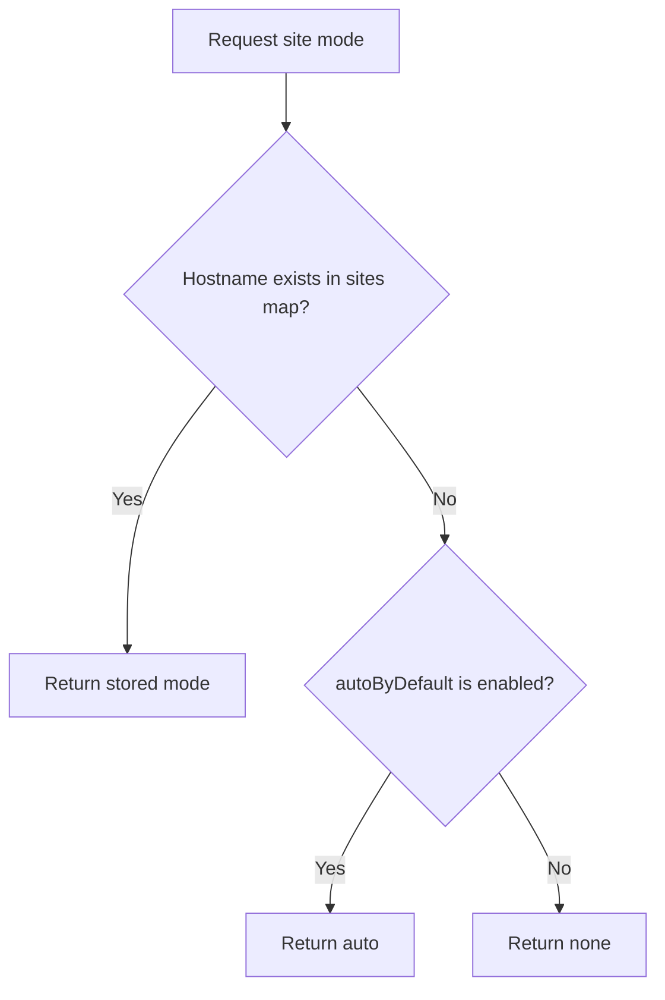
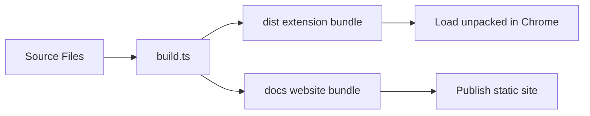

# BiDi Code Explanation

This document explains how the BiDi extension works at the code level, how the main modules interact, and what happens from page load to runtime updates.

## 1. What the project is

BiDi is a Chrome extension that fixes right-to-left rendering on websites that do not handle Hebrew, Arabic, Persian, or other RTL text well.

It supports three modes:

| Mode | Meaning | Effect |
| --- | --- | --- |
| `none` | Do nothing | Leaves the page untouched |
| `auto` | Detect RTL content automatically | Applies bidi styling only where needed |
| `rtl` | Force whole page RTL | Sets `document.documentElement.style.direction = "rtl"` |

The extension is built around one core idea:

1. Read the current site preference from synced storage.
2. Apply a direction strategy in the content script.
3. Keep the page updated as the DOM changes.
4. Let the popup update the preference per hostname.
5. Reflect the current mode in the toolbar icon.

## 2. High-level architecture



## 3. Source layout

| File | Responsibility |
| --- | --- |
| `src/content.ts` | Applies RTL behavior inside web pages |
| `src/rtl.ts` | Detects whether text is RTL or only contains RTL characters |
| `src/storage.ts` | Reads and writes per-site mode and the default behavior |
| `src/popup.ts` | Popup logic for mode selection and default toggle |
| `src/background.ts` | Updates the toolbar icon and reinjects scripts on install |
| `manifest.json` | Declares extension entry points and permissions |
| `build.ts` | Builds both the extension and the static website |
| `src/*.test.ts` | Unit tests for detection, storage, and DOM behavior |

## 4. Runtime flow

### 4.1 Page load

When a matching page loads, Chrome injects `content.js` at `document_start` because of `manifest.json`.

The content script:

1. Reads the hostname.
2. Loads the mode with `getSiteMode(hostname)`.
3. Applies the selected mode:
   - `none`: no changes
   - `rtl`: force document-level direction
   - `auto`: scan the DOM and start a `MutationObserver`

### 4.2 Mode selection

The popup determines the current active tab hostname and shows three buttons:

- `NONE`
- `AUTO`
- `FULL RTL`

When the user clicks a button, `setSiteMode(hostname, mode)` stores the choice in `chrome.storage.sync`. The content script listens to storage changes and reacts without needing a full reload.

### 4.3 Dynamic content

Modern sites frequently stream content or replace DOM fragments after initial load. In `auto` mode, the content script uses a `MutationObserver` to:

- scan newly added elements
- react to text changes
- re-evaluate the nearest relevant block element
- rescan descendants if block direction flips

That makes the extension work on apps such as chat UIs, editors, and SPA-style sites.

## 5. The core logic in `src/content.ts`

`src/content.ts` is the heart of the extension.

### 5.1 Marker strategy

The file defines:

- `MARKER = "data-bidi"`
- `MARKER_SELECTOR = "[data-bidi]"`

Any element changed by the extension is tagged with `data-bidi`. This makes cleanup and re-processing possible.

The helper methods are:

- `markElement(el, prop, value)`: writes either `style.direction` or `style.unicodeBidi` and adds the marker
- `unmarkElement(el)`: removes the inline bidi styles and deletes the marker

### 5.2 Inline vs block handling

The code treats inline and block-like elements differently.

Inline tags are listed in `INLINE_TAGS`, for example:

- `SPAN`
- `B`
- `I`
- `EM`
- `STRONG`
- `A`
- `CODE`
- `BUTTON`
- `LABEL`
- `IMG`
- `INPUT`

Why this split exists:

- Block containers should control layout direction with `direction: rtl`
- Inline fragments should usually not flip layout, so they use `unicode-bidi: plaintext`

### 5.3 Text extraction rules

Two helpers determine what text is relevant:

- `getDirectText(el)`: reads only direct text nodes
- `getInlineText(el)`: reads direct text plus text from inline children

This avoids incorrectly marking large wrappers just because a deeply nested child contains RTL text.

Example:

```html
<span><b>שלום</b> hello</span>
```

The outer `span` should not be marked solely because the inner `b` is RTL. The code explicitly avoids that mistake.

### 5.4 Applying auto direction

The main decision function is `applyRtlToElement(el)`.

For inline elements:

1. Read only direct text.
2. If the text contains RTL and the element is not already inside a marked RTL ancestor, apply `unicode-bidi: plaintext`.
3. Otherwise remove any BiDi marker from that inline element.

For block elements:

1. Read inline-visible text with `getInlineText`.
2. If the text is empty, clear previous BiDi state.
3. If `isRtlText(text)` returns `true`, set `direction: rtl`.
4. Otherwise clear previous BiDi state.

This design gives two levels of behavior:

- whole paragraphs or containers can become RTL
- smaller inline fragments can still display correctly inside LTR paragraphs

## 6. DOM scanning algorithm

The function `scanForRtl(root)` walks the DOM with `document.createTreeWalker(root, NodeFilter.SHOW_ELEMENT)`.

That means:

- every element under `root` is visited
- `applyRtlToElement()` is executed on each `HTMLElement`
- block elements are generally processed before their inline descendants during preorder traversal

This ordering matters. If a block is marked RTL first, its inline descendants can skip unnecessary `unicode-bidi` styling.



## 7. MutationObserver behavior

`startObserver()` creates one shared `MutationObserver`.

It listens for:

- `childList`
- `subtree`
- `characterData`

Important details:

- New nodes are scanned individually instead of rescanning the entire document.
- Text mutations collect the nearest containing block using `nearestBlock(el)`.
- The observer re-evaluates each changed block once by storing them in a `Set`.
- If a block changes from marked to unmarked, or from unmarked to marked, the code rescans that block subtree so inline descendants can adapt.

This is the part that keeps auto mode efficient enough for live applications.



## 8. RTL detection in `src/rtl.ts`

This file is intentionally small and deterministic.

### 8.1 `containsRtl(text)`

Uses a regex to detect whether the text contains any RTL characters at all.

Covered ranges:

- Hebrew: `U+0590-U+05FF`
- Arabic: `U+0600-U+06FF`
- Arabic Supplement: `U+0750-U+077F`
- Arabic Extended-A: `U+08A0-U+08FF`

This check is used for inline fragments where the code only needs to know whether RTL is present.

### 8.2 `isRtlText(text)`

Counts RTL and LTR characters and returns `true` only when RTL characters are the majority.

The LTR heuristic includes:

- ASCII uppercase and lowercase English letters
- Latin extended range `U+00C0-U+024F`

This majority-based approach helps avoid flipping whole paragraphs just because a short RTL phrase appears inside otherwise LTR text.



The pie chart is conceptual. It describes decision outcomes, not measured production telemetry.

## 9. Storage model in `src/storage.ts`

The storage layer uses `chrome.storage.sync`, so preferences follow the user across synced Chrome profiles.

Stored keys:

| Key | Meaning |
| --- | --- |
| `sites` | Map of hostname to mode |
| `autoByDefault` | Global default for unknown sites |

### 9.1 Read path

`getSiteMode(hostname)`:

1. Loads `sites` and `autoByDefault`.
2. If the hostname has an explicit mode, returns it.
3. Otherwise returns:
   - `auto` when `autoByDefault !== false`
   - `none` when `autoByDefault === false`

### 9.2 Write path

`setSiteMode(hostname, mode)`:

1. Loads the current `sites` map and default setting.
2. If the new mode is `none` and auto-default is disabled, it removes the hostname entry.
3. Otherwise it stores the explicit hostname mode.

This keeps storage compact while preserving per-site overrides when needed.



## 10. Popup flow in `src/popup.ts`

The popup is intentionally simple.

Responsibilities:

- get the active tab hostname
- read the current mode for that hostname
- render one button per mode
- toggle the active CSS class
- let the user control `autoByDefault`

The popup does not directly message the content script. Instead, it updates `chrome.storage.sync`, and the rest of the extension reacts through storage listeners. That keeps the interaction model simple and decoupled.

## 11. Background behavior in `src/background.ts`

The background service worker mostly handles extension-level UI state.

### 11.1 Icon rendering

It creates toolbar icons with a mode label:

- no label for `none`
- `AUT` for `auto`
- `RTL` for `rtl`

It loads the PNG icon, renders a small label on an `OffscreenCanvas`, then passes `ImageData` to `chrome.action.setIcon`.

### 11.2 When it updates

`updateIcon(tabId, url)` runs when:

- the extension is installed or reloaded
- the active tab changes
- a tab finishes loading
- synced storage changes

### 11.3 Re-injection on install

On `chrome.runtime.onInstalled`, the service worker queries existing HTTP and HTTPS tabs and injects `content.js` into them. This avoids waiting for each tab to refresh after the extension is installed or updated.

## 12. Manifest wiring

`manifest.json` defines the extension as Manifest V3.

Key choices:

- `background.service_worker = "background.js"`
- `content_scripts` inject `content.js` on `<all_urls>`
- `run_at = "document_start"`
- permissions: `storage`, `activeTab`, `tabs`, `scripting`
- host permissions: `<all_urls>`

This gives the extension enough access to:

- read and save per-site settings
- inspect current tab URLs
- inject scripts into existing pages on install
- run content logic on every site

## 13. Build pipeline in `build.ts`

The repository builds two outputs.

### 13.1 Extension build

Bun bundles:

- `src/content.ts`
- `src/popup.ts`
- `src/background.ts`

into `dist/`.

It then copies:

- `src/popup.html`
- `manifest.json`
- `icons/`

That `dist/` directory is the unpacked Chrome extension.

### 13.2 Website build

The same script also builds the project website into `docs/` for GitHub Pages:

- bundles `website/main.ts`
- rewrites HTML references from `main.ts` to `main.js`
- copies shared assets and styles

This means:

- `dist/` is the extension artifact
- `docs/` is the website artifact
- `documentation/` is a human-authored source folder for maintainers



## 14. Test coverage

The test suite focuses on the rules that are easiest to break.

### 14.1 `src/rtl.test.ts`

Validates:

- Hebrew and Arabic detection
- mixed RTL/LTR classification
- empty, numeric, and punctuation-only inputs

### 14.2 `src/storage.test.ts`

Validates:

- default behavior for unknown sites
- per-site overrides
- compaction behavior when saving `none`

### 14.3 `src/content.test.ts`

Validates:

- inline vs block behavior
- nested inline handling
- RTL block flips to LTR
- LTR block flips to RTL
- descendant rescans after content changes
- cleanup of stale RTL state

## 15. Practical mental model

If you need to reason about this code quickly, the simplest model is:

1. `storage.ts` decides what mode a site should be in.
2. `content.ts` enforces that mode inside the page.
3. `rtl.ts` decides whether text looks RTL enough to matter.
4. `popup.ts` changes user preferences.
5. `background.ts` reflects those preferences in the browser UI.
6. `build.ts` packages everything for Chrome and for the project website.

## 16. Current implementation tradeoffs

The code is optimized for predictable behavior and low ceremony rather than full linguistic analysis.

Tradeoffs in the current approach:

- detection is heuristic, not Unicode BiDi-algorithm complete
- block direction is based on majority counting, which is simple and fast
- inline handling prefers visual correctness in mixed paragraphs over deep semantic interpretation
- the observer uses targeted rescans to avoid full-page rescanning on every mutation

That tradeoff is reasonable for a browser extension that needs to run on arbitrary websites with low overhead.

## 17. Suggested reading order for maintainers

If you are new to the codebase, read files in this order:

1. `manifest.json`
2. `src/storage.ts`
3. `src/rtl.ts`
4. `src/content.ts`
5. `src/content.test.ts`
6. `src/popup.ts`
7. `src/background.ts`
8. `build.ts`

That order mirrors the actual runtime flow closely enough to make the code easy to follow.
